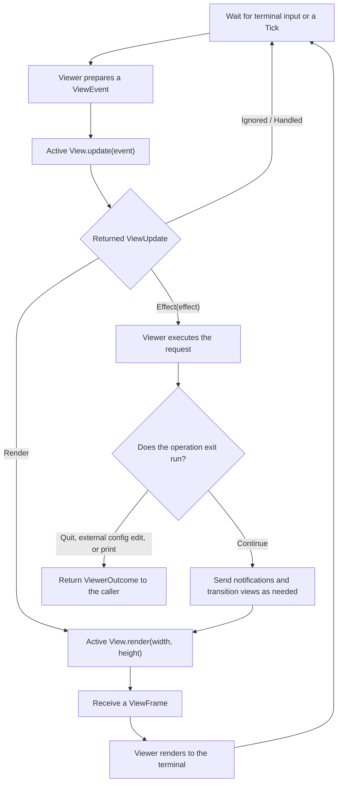

## View transitions

Opening *focus* or *preview*, or opening *jaq* from the input or *focus* view, enters a child view. Pressing `Esc` while browsing returns one level to the calling view, preserving its selection and display state. Rerunning an expression with `:` inside *jaq* updates the current view's results. `:print` writes a value to standard output and exits vy.

## Viewer flow

[viewer.rs](https://github.com/ynqa/vy/blob/main/src/viewer.rs) defines the `View` trait and the types passed between Viewer and each View.
`Viewer::run()` in [runtime.rs](https://github.com/ynqa/vy/blob/main/src/viewer/runtime.rs) controls input, execution, and rendering.
The diagram shows a typical iteration after the initial render.

The following table maps each diagram node to its code. BrowseView is linked as a concrete View implementation.

| Node | Corresponding code |
| --- | --- |
| Wait for terminal input or a Tick | [`tokio::select!` in `run()`](https://github.com/ynqa/vy/blob/main/src/viewer/runtime.rs#L156) |
| Viewer prepares a ViewEvent | [`dispatch_event()`](https://github.com/ynqa/vy/blob/main/src/viewer/runtime.rs#L346), [Tick creation and dispatch](https://github.com/ynqa/vy/blob/main/src/viewer/runtime.rs#L163) |
| Active View.update(event) | [Action dispatch](https://github.com/ynqa/vy/blob/main/src/viewer/runtime.rs#L375), [`BrowseView::update()`](https://github.com/ynqa/vy/blob/main/src/viewer/view/browse.rs#L493) |
| Returned ViewUpdate | [Response handling in `run()`](https://github.com/ynqa/vy/blob/main/src/viewer/runtime.rs#L166), [`ViewUpdate` definition](https://github.com/ynqa/vy/blob/main/src/viewer.rs#L294) |
| Viewer executes the request | [`execute_effect()`](https://github.com/ynqa/vy/blob/main/src/viewer/runtime.rs#L181) |
| Does the operation exit run? | [Checking the return value of `execute_effect()`](https://github.com/ynqa/vy/blob/main/src/viewer/runtime.rs#L170) |
| Return ViewerOutcome to the caller | [Return from `run()`](https://github.com/ynqa/vy/blob/main/src/viewer/runtime.rs#L171), [Outcome handling in `main`](https://github.com/ynqa/vy/blob/main/src/main.rs#L80) |
| Send notifications and transition views as needed | [Notifications and stack push in `open_view()`](https://github.com/ynqa/vy/blob/main/src/viewer/runtime.rs#L233), [Copy result notification](https://github.com/ynqa/vy/blob/main/src/viewer/runtime.rs#L196), [`BrowseView::notify()`](https://github.com/ynqa/vy/blob/main/src/viewer/view/browse.rs#L476) |
| Active View.render(width, height) | [Calling render on the active View](https://github.com/ynqa/vy/blob/main/src/viewer/runtime.rs#L323), [`BrowseView::render()`](https://github.com/ynqa/vy/blob/main/src/viewer/view/browse.rs#L447) |
| Receive a ViewFrame | [Receiving `frame`](https://github.com/ynqa/vy/blob/main/src/viewer/runtime.rs#L323), [`ViewFrame` definition](https://github.com/ynqa/vy/blob/main/src/viewer.rs#L329) |
| Viewer renders to the terminal | [Updating the Renderer and drawing](https://github.com/ynqa/vy/blob/main/src/viewer/runtime.rs#L342) |
